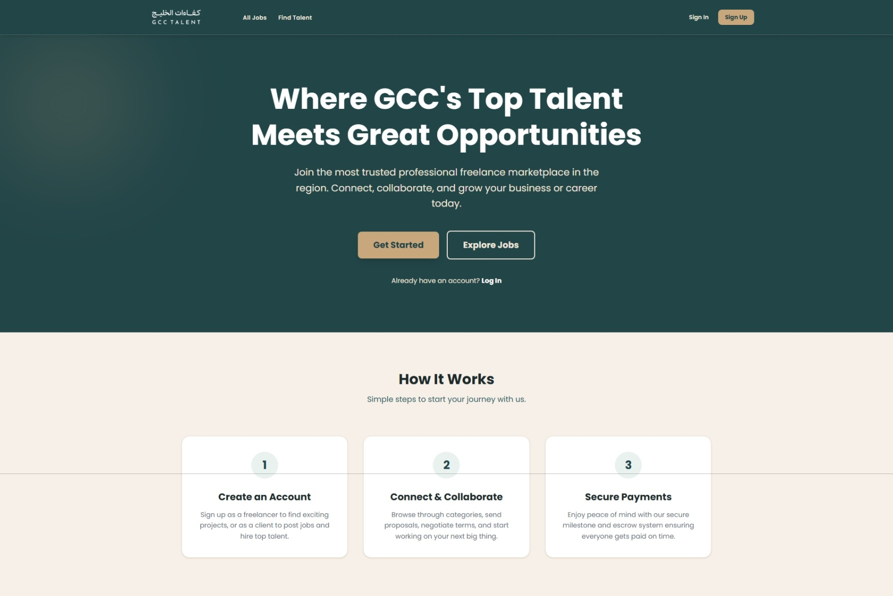

# GCC Talent Marketplace (كفاءات الخليج)

A robust, enterprise-grade digital freelance marketplace engineered to connect businesses and clients across the Gulf region with vetted professionals. Functioning on a dual-sided marketplace model (similar to Upwork and Fiverr), the platform supports job postings, proposal bidding, custom milestone agreements, and direct communication. Financial integrity is enforced through a simulated escrow and wallet system powered by atomic database transactions.



### Live Demo & Planning
* **[Project Planning Material](https://trello.com/b/RRuEklHK/gcc-talent)**

---

## Team & Vertical Slices

The project was delivered using an agile, decoupled MERN architecture with strict vertical feature slicing:

* **Ali Saleh (Dev 1) — Identity, Admin, & Notifications**: Role-based access control (RBAC), JWT authentication with refresh token flows, user profile setup, platform notification pipelines, and moderation tooling (managing users, categories, and dispute resolution).
* **Hasan Ali (Dev 2) — Jobs, Search, & Communication**: Comprehensive job creation workflows, searchable talent and job directories featuring multi-parameter filtering, proposal lifecycle management, reviews, and a real-time messaging workspace with dynamic read receipts.
* **Al-Asfoor (Dev 3) — Contracts, Finances, & DevOps**: Contract workspaces with milestone state machines, simulated digital wallets, escrow protection with atomic ACID transactions, and the GitHub Actions CI/CD deployment pipeline.

---

## Key Features

* **Role-Based Authentication & Profiles**: Secure sign-up/sign-in flows supporting distinct **Client** and **Freelancer** workflows. Protected routes enforce strict authorization, while public profile pages spotlight bios, ratings, skills, and portfolio projects.
* **Job Board & Proposal Lifecycle**: Clients can draft, publish, and manage fixed-price or hourly listings with budget boundaries and application deadlines. Freelancers can pitch competitive bids, define milestone deliverables, and attach proof documents.
* **Contract Workspaces & Milestone Tracking**: Automatically generates interactive contract spaces upon hiring. Milestones track sequential statuses (`pending` → `funded` → `delivered` → `approved`) with built-in revision cycles.
* **Escrow & Wallet System (ACID Protected)**: Client funds are moved into a locked escrow state upon milestone activation. Payouts are automatically dispatched to the freelancer's wallet upon milestone sign-off, deducting a configurable platform commission.
* **Real-Time Direct Messaging**: Unified chat threads supporting attachment file exchange, conversation search, unread badge notification counters, and automated read receipts.
* **Review & Reputation System**: Double-sided reviews on closed contracts with category ratings (Communication, Quality, Timeliness) that calculate rolling weighted profile averages.
* **Admin Control Center**: Dedicated management dashboard for platform administrators to regulate categories, review flagged reports, moderate suspicious profiles, and arbitrate milestone escrow disputes.

---

## Tech Stack

* **Frontend**: React 18 (Vite), React Router v6, Tailwind CSS, Material Symbols
* **Backend**: Node.js 20 LTS, Express.js (RESTful Architecture)
* **Database**: MongoDB Atlas with Mongoose ODM (Replica Set required for ACID transactions)
* **File Storage**: Cloudinary Media API
* **Security & Auth**: JSON Web Tokens (short-lived access tokens & refresh tokens), bcryptjs password hashing, OAuth (Google & LinkedIn)
* **Testing & CI/CD**: Jest, Supertest, GitHub Actions

---

## Prerequisites

Ensure you have the following installed and configured before running locally:
* **Node.js**: v20 LTS or higher
* **MongoDB**: A running MongoDB instance or MongoDB Atlas cluster (**Must be a Replica Set** to support session transactions)
* **Cloudinary Account**: Cloud name, API key, and secret for media assets
* **OAuth Credentials**: Client IDs and secrets from Google Cloud Console and LinkedIn Developers (optional, for social login)

---

## Installation & Local Setup

**1. Clone the repository**
```bash
git clone [https://github.com/your-org/gcc-talent-marketplace.git](https://github.com/your-org/gcc-talent-marketplace.git)
cd gcc-talent-marketplace
```

**2. Backend Setup**
```bash
cd server
npm install
```

Create a `.env` file in the `server/` directory:
```env
PORT=3000
MONGODB_URI=mongodb+srv://<username>:<password>@cluster.mongodb.net/gcc_talent?retryWrites=true&w=majority
JWT_ACCESS_SECRET=your_jwt_access_secret
JWT_ACCESS_EXPIRES=30d
CLOUDINARY_CLOUD_NAME=your_cloudinary_name
CLOUDINARY_API_KEY=your_cloudinary_key
CLOUDINARY_API_SECRET=your_cloudinary_secret
EMAIL_USER=your_email_address
EMAIL_PASS=your_email_password
GOOGLE_CLIENT_ID=your_google_client_id
GOOGLE_CLIENT_SECRET=your_google_client_secret
LINKEDIN_CLIENT_ID=your_linkedin_client_id
LINKEDIN_CLIENT_SECRET=your_linkedin_client_secret
```

Seed initial demo data (1 Admin, 10 Clients, 20 Freelancers, categories, and active jobs):
```bash
npm run seed
```
* **Admin Demo**: `admin@gcctalent.test` / `Admin123!`
* **User Accounts**: Default password for all seeded users is `Password123!`

Start the backend API server:
```bash
npm run dev
```

---

**3. Frontend Setup**

Open a second terminal window:
```bash
cd client
npm install
```

Create a `.env` file in the `client/` directory:
```env
VITE_BACK_END_SERVER_URL=http://localhost:3000/api/v1
VITE_CLOUDINARY_CLOUD_NAME=your_cloud_name_here
VITE_CLOUDINARY_UPLOAD_PRESET=your_unsigned_preset_name
```

Start the Vite development server:
```bash
npm run dev
```

---

**4. Access the Application**

Visit `http://localhost:5173` in your browser.

---

## Application Architecture

```text
gcc-talent-marketplace/
├── client/
│   ├── src/
│   │   ├── components/       # Scaffolding, Modals, Navbars, Route Guards
│   │   ├── pages/            # Viewports (Job Board, Proposals, Profiles, Chat)
│   │   ├── services/         # Axios API clients mapped to resource domains
│   │   └── assets/           # Brand styling assets and SVG symbols
└── server/
    ├── src/
    │   ├── models/           # Mongoose schemas (User, Job, Contract, Review, etc.)
    │   ├── modules/          # Domain slices (jobs, contracts, auth, reviews)
    │   ├── middleware/       # Token verification, RBAC guards, file parsers
    │   └── utils/            # Transaction wrappers and error transformers
```

* **Atomic Transactions**: All escrow actions utilize `mongoose.startSession()` and `session.startTransaction()`. Balance deductions and escrow credits commit or abort simultaneously to avoid state desync.
* **Service Layer Pattern**: Business calculations (e.g., milestone approvals and platform fee splits) reside in dedicated service files, keeping controllers lean.

---

## Future Enhancements

* **WebSockets Integration**: Implement Socket.IO for push-delivered messaging and live read-receipt updates without background polling.
* **Automated Identity Verification**: Integration with regional verification services for freelancer credential badges.
* **Direct Payment Gateways**: Integrate regional GCC payment providers (e.g., BenefitPay, Tap, Fawry).
* **Localized Multi-Language Support**: Complete Arabic / English UI internationalization (i18n) with RTL layout toggles.

---

## Credits

Special thanks to the instructional team at General Assembly for their continuous mentorship, architectural feedback, and support throughout the development of this platform.